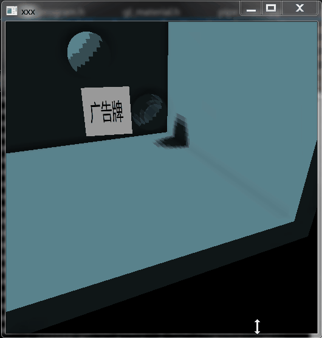
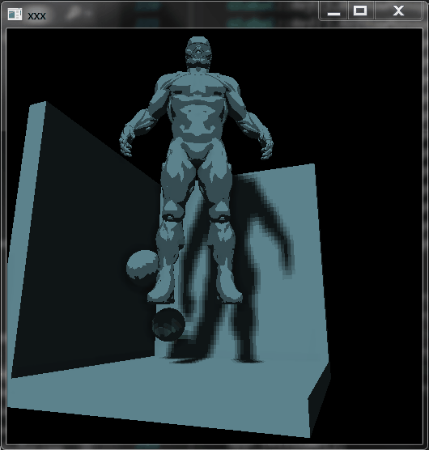

# OpenGL

．　荒废了太久，趁着“寒假”死磕了两周，验证了不少想法，解开了不少疑惑，代码质量当然是没有的（|||-_-|||），一切只为看到结果，有空了再写每一项的细节。

[> 项目地址 <](https://github.com/mmc1993/opengl)

## 2019/8/10 更新

**顶点动画-广告牌(一)**

*面片广告牌*

*模型广告牌*

## 2019/7/14 更新

**卡通渲染(一)**

*Phong-Blinn光照*

*Lambert光照*

*Half-Lambert光照*

*Lamaber-卡通渲染*

*Half-Lamaber-卡通渲染*

*渐变过渡*

## 2019/6/27 更新

**SSAO**

*SSAO 遮蔽贴图*

*无SSAO 单光源渲染*

*有SSAO 单光源渲染*

*无SSAO 多光源渲染*

*有SSAO 多光源渲染*

*有SSAO => 无SSAO 渐变*

## 2019/5/12 更新

**延迟渲染**

*GBuffer 世界坐标*

*GBuffer 世界法线*

*GBuffer 漫反射*

*300个点光源*

## 2019/3/6 更新

**一个粗糙的模型**

## 2019/2/26 更新

**HDR**

*未开启HDR，远距离*

*未开启HDR，近距离*

*开启HDR，远距离*

*开启HDR，近距离*

**法线贴图**

*无法线贴图*

*无法线贴图*

*有法线贴图*

*有法线贴图*

**视差贴图**

*无视差贴图*

*无视差贴图*

*有视差贴图*

*有视差贴图*

**泛光**

*无泛光*

*提取亮度*

*泛光效果*

*泛光效果*

## 2019/2/2 更新

**标准光照模型**

*环境光*

*漫反射*

*高光*

*标准光照*

*标准光照*

*标准光照*

*标准光照*

**多纹理**

**光源**

*方向光*

*点光源*

*聚光灯*

*多光源*

**描边**

**环境映射**

*反射*

*折射*

*无反射贴图*

*有反射贴图*

**渲染实例化数组**

*1秒6千个模型渲染*

*1秒12万个模型渲染*

*拉近距离*

**后期处理**

*无后期*

*置灰*

*反色*

*边缘*

*模糊*

**几何着色器**

*膨胀模型*

*渲染法线*

**全透/半透/不透混合渲染**

*全透部分渲染错误*

*半透部分渲染错误*

*正确渲染*

**多相机渲染**

**阴影**

*方向光阴影 256分辨率 无平滑*

*方向光阴影 256分辨率 有平滑*

*方向光阴影 512分辨率 无平滑*

*方向光阴影 512分辨率 有平滑*

*方向光阴影 1024分辨率 无平滑*

*方向光阴影 1024分辨率 有平滑*

*方向光动态光源*

*聚光灯阴影*

*聚光灯动态光源*

*点光源阴影*

*点光源动态光源*

